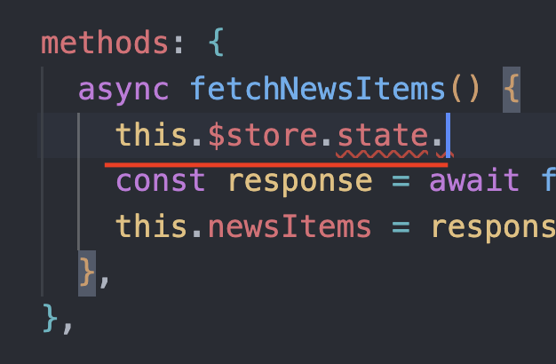
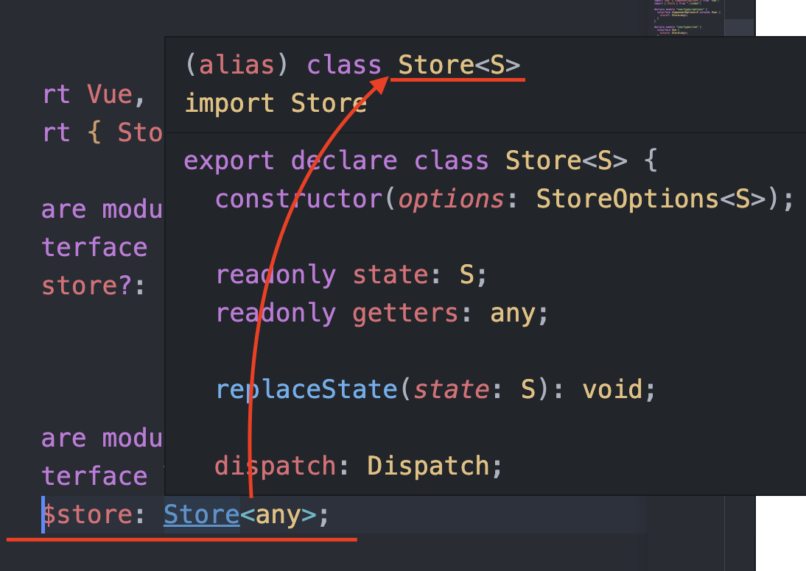
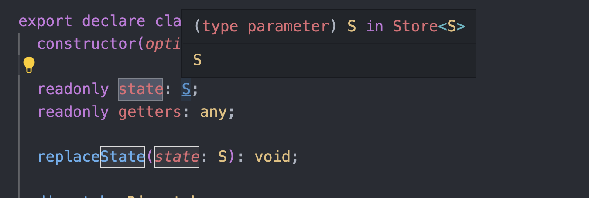
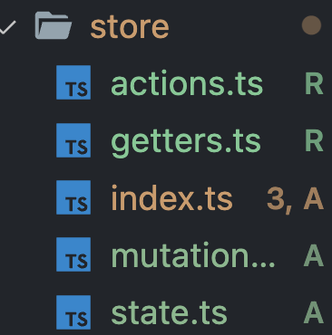
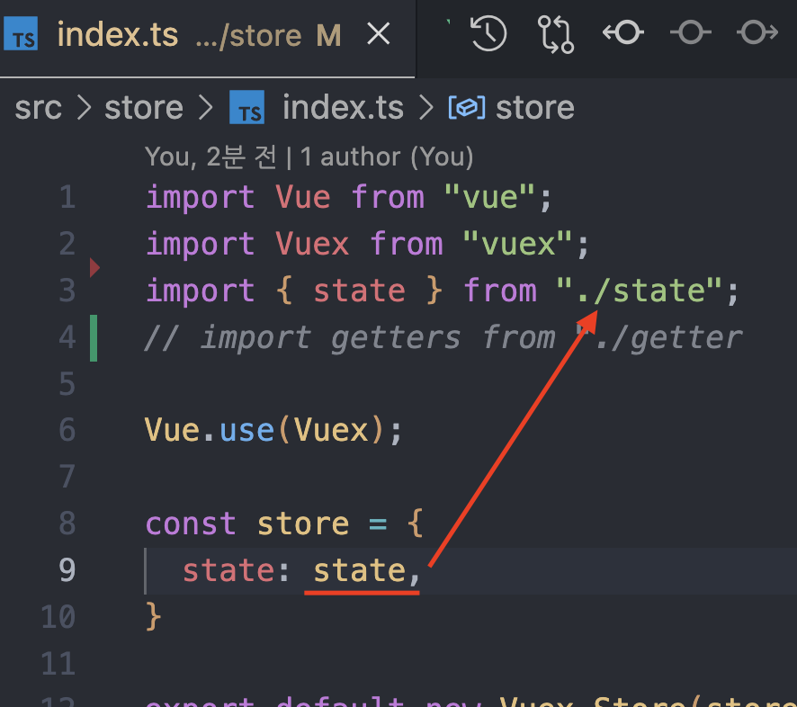
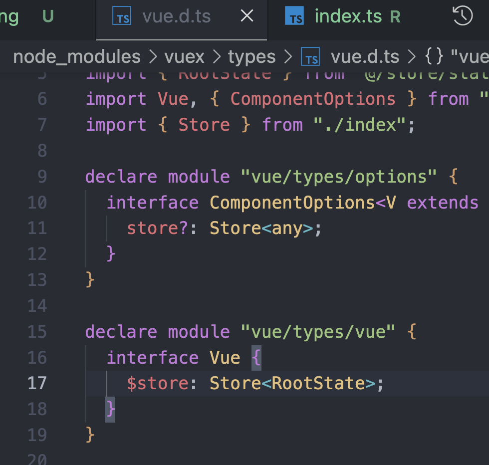

this.$store.state 내부의 type 도 추론이 될 순 없나 ?

### 판교님 말씀왈.
- $store 내부로 들어가 보면 Vue 라는 interface 에서, $store 를 확장했다고 보면 되는데, Vue 내부적으로 정의된 타입



(인터페이스 머징) 두번 인터페이스를 쓰게 되면 (declaration merging) 선언 병합이 이루어지게 되어 확장이 된다.

vuex 를 썼을때 vue 내부적으로 $store 로 확장을 하게 된는데, 제일 중요한건 Store 타입 안에 any 가 들어가 있기 때문에 컴포넌트 레벨에서 store 를 접근하려고 하면, any 를 기준으로 추론이 된다.
  


그리하여, 맨처음 언급했던
$store.state. <- 이 바로 다음을 추론하고 싶은게 우리의 니즈인데, vuex state 타입추론 을 통해 해결할 수 있다고 한다. 어서 해보자,



store 에 state.ts 를 만들어 주자.

```ts
import { NewsItem } from "@/api";

export const state = {
    news: [] as NewsItem[]
}

export type RootState = typeof state;
```

그런다음 index.ts 에서 state 부분을 만들었던 state 를 써준뒤


컴포넌트 레벨에서 추론이 되는지 확인을 해봤자 안될꺼다.
vuex 의 store 에선 여전히 state 가 any 타입으로 제레릭이 받아주고 있어서 인데,



그럼 그냥 위사진처럼 nodeModules 내부 에 vuex types 에서 직접 RootState 로 변경해주면 타입 추론이 되는것을 확인 할 수 있다.
