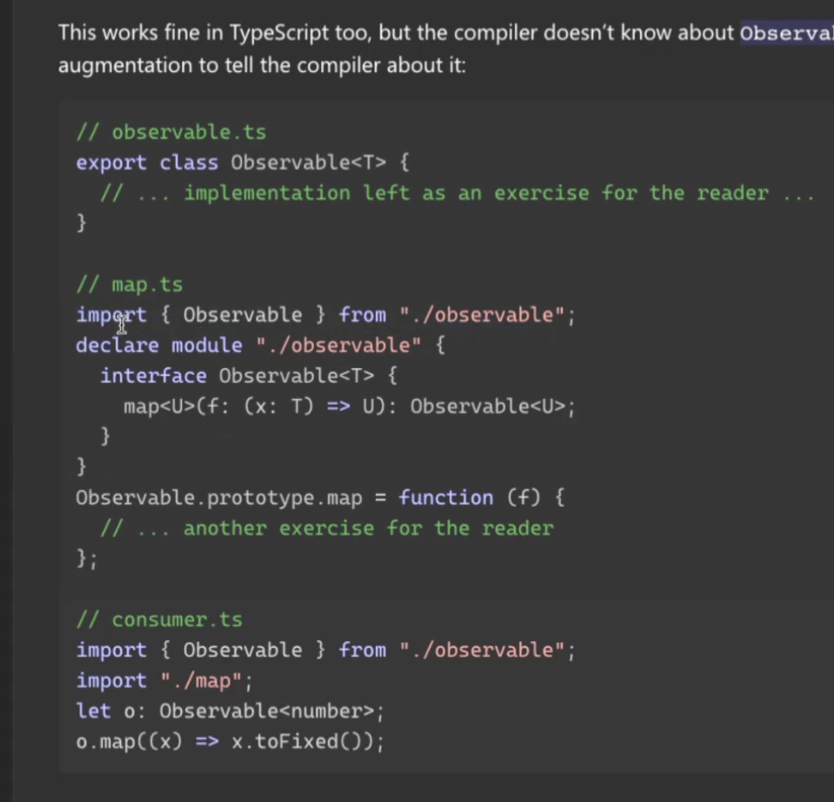

### 타입모듈 확장 방법


```js
// observable.ts -> 그냥 js 클래스다.
export class Observable<T> {
  // ... implementation left as an exercise for the reader ...
}
// map.ts 
// -> 타입스크립트 이기 때문에 모듈을 들고와서 (vue 모듈을 들고와서)
import { Observable } from "./observable";
// -> 인터페이스를 추가로 정의해 준뒤 (vue 모듈에 정의해 준뒤 <vue 에 미리 정의해둔> ) [아래 캡쳐 참조]
declare module "./observable" { // vue 내부적으로 추론하고있는 타입에 대한 확장을 프로젝트 레벨에서 진행했기 때문
  interface Observable<T> {
    map<U>(f: (x: T) => U): Observable<U>;
  }
}
Observable.prototype.map = function (f) {
  // ... another exercise for the reader
};
// consumer.ts
// App.vue 에서 store 를 쓰는것과 동일하다
import { Observable } from "./observable";
import "./map";
let o: Observable<number>;
o.map((x) => x.toFixed());
```

### [2]

추론되는건 커스텀 타입

url: https://www.typescriptlang.org/docs/handbook/declaration-merging.html#module-augmentation


## 정리
```js

// observable.ts -> vue 내부 타입
export class Observable<T> {
  // ... implementation left as an exercise for the reader ...
}
// map.ts -> 프로젝트.d.ts
import { Observable } from "./observable";
declare module "./observable" {
  interface Observable<T> {
    map<U>(f: (x: T) => U): Observable<U>;
  }
}
Observable.prototype.map = function (f) {
  // ... another exercise for the reader
};
// consumer.ts -> App.vue (컴포넌트)
import { Observable } from "./observable";
import "./map";
let o: Observable<number>;
o.map((x) => x.toFixed());
```