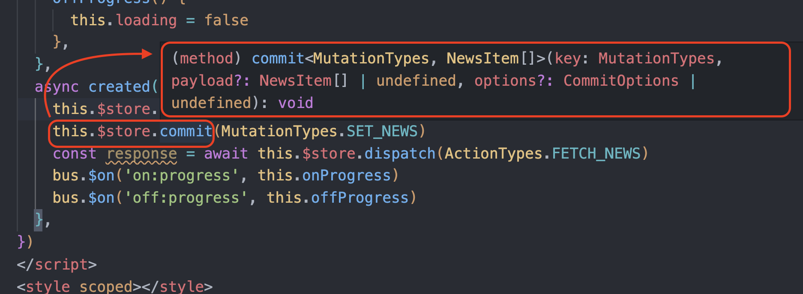
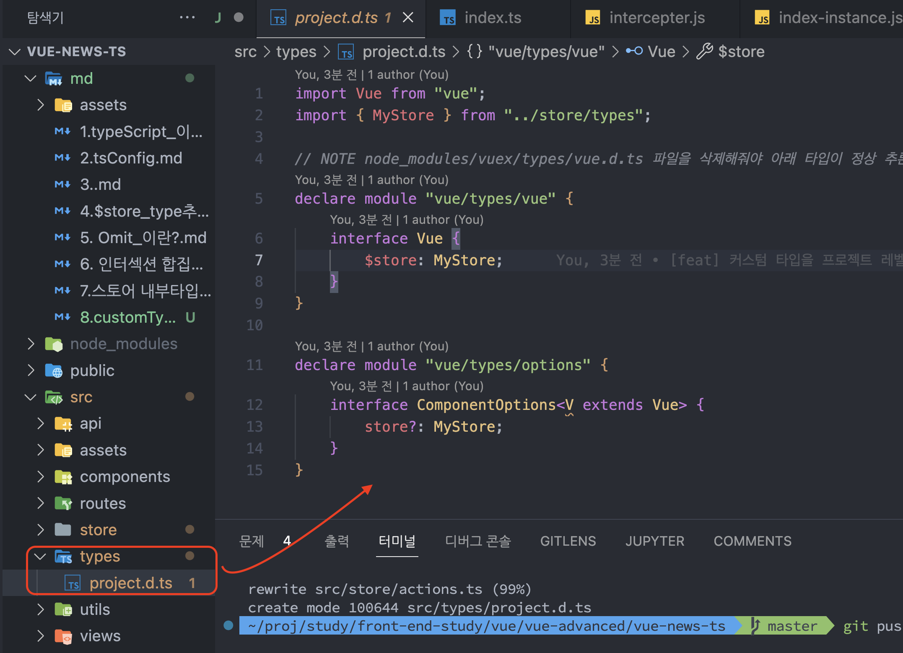
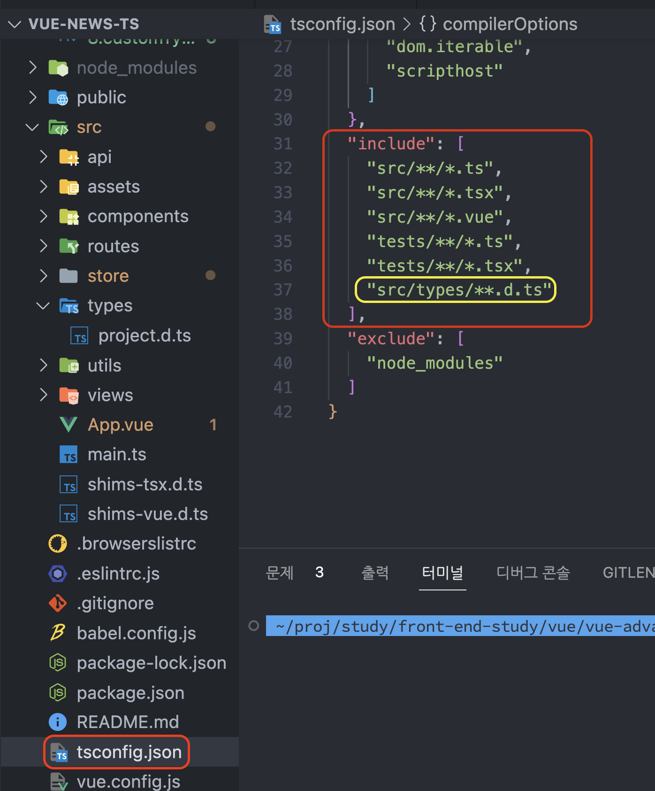
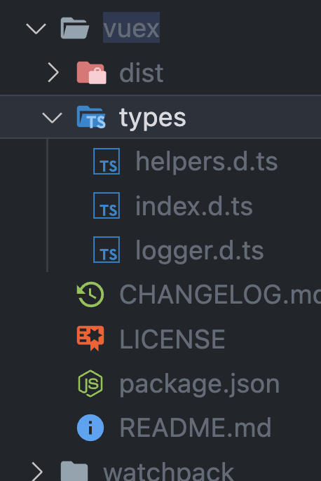

### 커스텀 타입을 프로젝트레밸로 설정하기

- 무슨말일까 ? 
node_modules/vuex/types/vue.d.ts 에는 $store?: Store<any> 라는 코드가 명시되어 있을것이다.

우리는 프로젝트 레벨에서 커스텀한 store, commit, dispatch 타입을 명시해주고 싶은 니즈가 있다.

아래와 같이 말이다.


project 레벨에서 타입추론이 되게 하는 방법은 node_mudles 의 vuex 라이브러리 내부에 
vue.d.ts 를 커스텀 하는 방식이 아닌
아래 처럼 type 이란 폴더를 생성후, 



ts config 의 노란색 박스를 (방금 만들었던 파일을 포함하겠다) 새로 기입해준뒤

(타입스크립트에서 원래 모듈을 읽어오는 방식을 이용)

vue.d.ts 를 제거해주면 된다. (삭제해준뒤의 캡쳐)


### 왜 프로젝트 레벨에서 타입추론이 필요해 ? 

- 이유는 단순하다.
  -  어떤 타입으로 추론되는지 명시적으로 노출되는게 타입스크립트의 매력중 하나다.
  -  . <- (쩜) 을 찍었을 뿐인데 내가 비동기 통신후 , 받게될 타입 과, commit (vuex 자원) 할수있는 Action Type 까지 친절하게 알려준다면 마다할 이유가 없다.
- 반드시 써야하는가 
  - 나는 반드시 쓰고싶다.
  - 내손을 못믿기 보다는 휴먼에러를 내고싶지 않아서이다.
  - 타입스크립트를 쓰는 이유중 장점을 꼽자면 프로젝트의 안정성을 주기 때문이다.


```

```